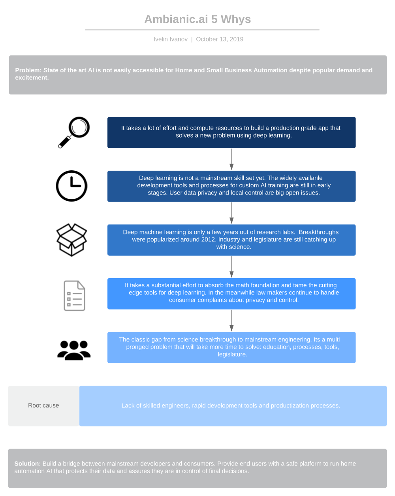
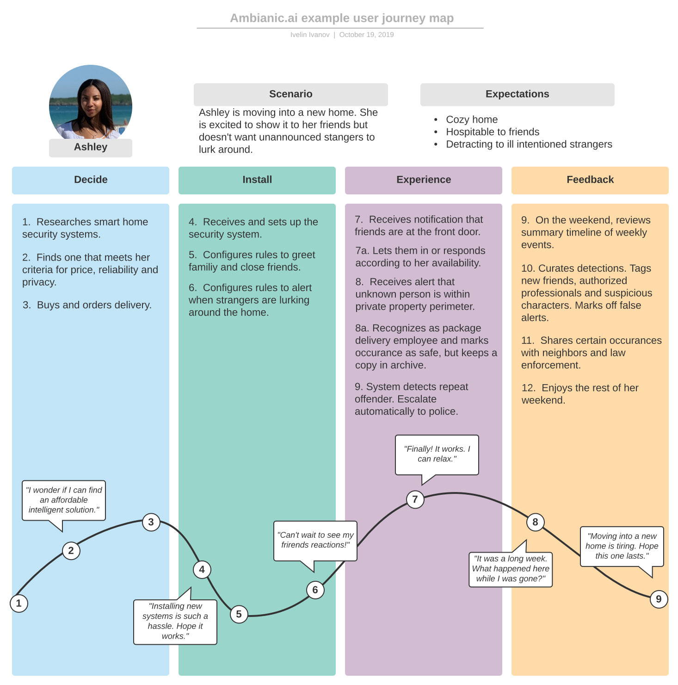
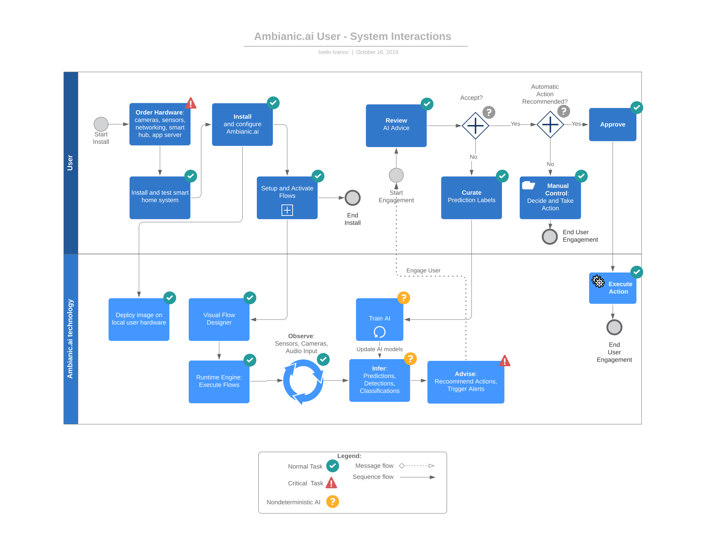

# Project mission

## Helpful AI for Home and Business Automation

Ambianic is an Open Source AI platform that puts local control and privacy
first. It enables users to run and train custom AI models
without compromising privacy and without sharing data with cloud providers.

[View on Github](https://github.com/ambianic/ambianic-core)

# Why?

What's the root cause for Ambianic.ai to exist? Below is a
[5 Whys](https://en.wikipedia.org/wiki/Five_whys) diagram that
tries to answer this key question objectively.

Needless to say there are
subjective reasons which are equally if not more influential for the existence
of this project such as basic human excitement to serve a bigger purpose
via open source AI.

# User Journey

Ambianic's roadmap is inspired by user stories and community feedback.
The following diagram illustrates an example user journey.

User journeys help us align on the bigger picture and segue into  
agile development constructs such as user stories and sprints.
More user journeys will be added over time as the project evolves. Some of the
candidate topics include:

- **Home Automation**
    - Turn traditional door locks into smart locks with Face Recognition.
    - Alert parents if a crying toddler is left unattended for more than 15 minutes.
    - Raise an alert if a baby is seated near a car door without child lock enabled while in motion.

- **Business Automation**
    - Prevent accidents by alerting drivers who act sleepy or distracted.
    - Make sure that a factory floor position is not left unattended for more than 15 minutes.
    - Recognize presence of unauthorized people in a restricted access work area.

# User - System Interactions

Users interact with the system in two phases:

1. First Time Installation
2. Consequent App Engagements

The following diagram illustrates the high level user - system interactions.

# User Interface Flow

The User Interface is centered around three main activities:

1. Setup Ambianic Edge to communicate with smart home devices: sensors, cameras, microphones, lights, door locks, and others.
2. Design flows to automatically observe sensors and make helpful recommendations.
3. Review event timeline, alerts and actionable recommendations.

The Ambianic UI is architected as an Offline-First PWA
(Progressive Web Application). It does not assume that the user has constant
broadband internet access when she needs to interact with Ambianic local data
 and devices. We anticipate a range of real world scenarios
with low bandwidth or no-Internet access at all when the use may need to
 review Ambianic alerts, timeline data, edit flows and configure Edge devices.

It stores data locally on the client device (mobile or desktop) and,
when there’s a network connection,
syncs data to the user's Ambianic server and resolves any data conflicts.
When possible it communicates directly with local Ambianic Edge devices
minimizing network routing overhead.

# Project Status

At this time, Ambianic is in active early formation stages. Design and implementation decisions are made daily with focus on advancing the project to an initial stable version as soon as possible.

If you are willing to take the risk that comes with early stage code and are able to dive deep into Python, Javascript, Gstreamer, and Tensorflow code, then please keep reading. Otherwise you can register to [watch for new releases](https://github.com/ambianic/ambianic-core). We will notify you as soon as a stable release is out.

# Product Design Goals

Our goal is to build a product that is useful out of the box:

 - Less than 15 minutes setup time
 - Less than $75 in hardware costs
   + Primary platform: Raspberry Pi 4 B, 4GB RAM, 32GB SDRAM
 - No coding required to get started
 - Decomposable and hackable for open source developers

# Run in Development Mode

If you would like to try the current development version, follow these steps:

1. Clone this git repository.
2. `./ambianic-start.sh`
3. Study `config.yaml` and go from there.

# Contributors
If you are interested in becoming a contributor to the project, please read the [Contributing](legal/CONTRIBUTING.md) page and follow the steps. Looking forward to hearing from you!
