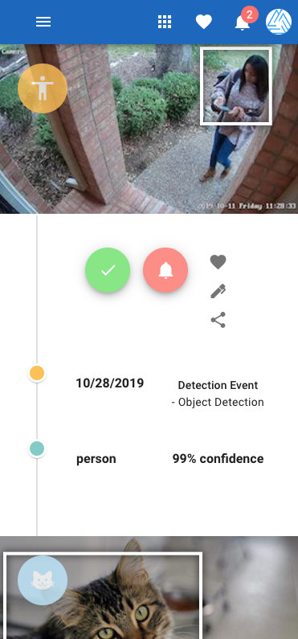
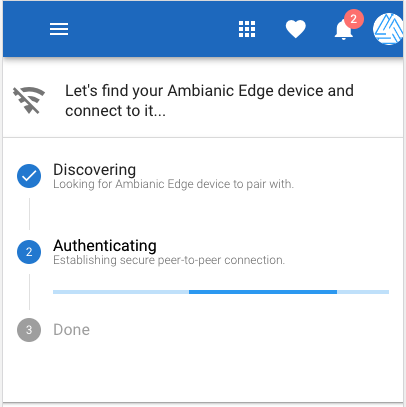
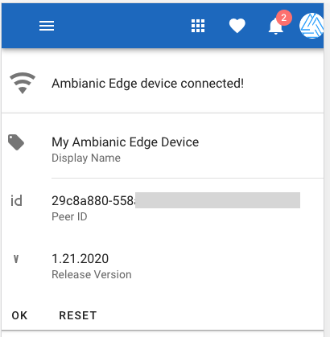

# 5 Minute Quick Start

Ambianic's goal is to provide helpful and actionable suggestions
in the context of home and business automation.

Ambianic has two major components: Ambianic UI and Ambianic Edge.

Ambianic UI is pre-deployed and readily available at [https://ui.ambianic.ai](https://ui.ambianic.ai). If you are familiar with Docker you will be able to install Ambianic Edge in less than 5 minutes. Let's go step by step.

## Ambanic Edge

Ambianic Edge is
[available](https://hub.docker.com/r/ambianic/ambianic-edge) as a docker image for ARM and x86 architectures so it can be deployed
on most modern machines and operating systems.

The reference test system is:
[Raspberry Pi 4 with 4GB RAM and 32GB SD card](https://www.raspberrypi.org/products/raspberry-pi-4-model-b/).

To deploy on a Raspberry Pi 4, you will need a recent
[Raspbian install](https://www.raspberrypi.org/documentation/setup/) with
[Docker on it](https://www.freecodecamp.org/news/the-easy-way-to-set-up-docker-on-a-raspberry-pi-7d24ced073ef/).
You can install and run the image in the default pi user space on Raspbian.

### Starting Ambianic Edge


```sh
# check if there is an image update
docker pull ambianic/ambianic-edge
# run latest image
docker run -it --rm  --name ambianic-edge \
  --mount type=bind,source=$PWD,target=/workspace \
  --net=host ambianic/ambianic-edge
```

You can stop the image with CTRL+C or
```
docker stop ambianic-edge
```

The first time you start Ambianic Edge it may take a minute or two. You will then see an error message that configuration file could not be found. Worry not. We will address that in due course. Let's get the base system running first. Then we will come back to configuration settings.

## Ambanic UI

[Ambianic UI](https://ui.ambianic.ai/) is a
modern prorgressive web application (PWA) that provides Plug-and-Play pairing and remote access
to an Ambianic Edge device.

Ambianic UI shows a timeline view with
important events around your home organized chronologically. Below is an example
timeline screenshot.



## Pairing Ambanic UI with Ambianic Edge

You can easily pair up your Ambianic UI with Ambianic Edge. It works similar to Airdrop.

Make sure to open Ambianic UI on the same local network where Ambianic Edge runs. Ambianic UI will initially display a welcome screen.


If you click on Settings, it will show  a pairing page like the one below:



After a few moments, pairing will conclude and you will see the unique identifier of your Ambianic Edge device.



Congratulations! Your Ambianic instance is now up and running!

## Configuration

You are now ready to configure Ambianic: pipelines, input sources and AI models.

Read on: [Configuring Ambianic Edge](configure.md).

Once you configure Ambianic Edge and restart the docker image, you should be able to see timeline view like the one above.

The pairing information is persisted on your Ambianic UI client device and you can now access Ambianic Edge from anywhere remotely! The connection is direct and encrypted end-to-end.

## Troubleshooting

If you experience problems with your initial setup and you can't find a good solution online, feel free to engage the team on [Twitter](https://twitter.com/ambianicai) or [open a github issue](https://github.com/ambianic).

## Supporting the project

If you find value in this project, consider supporting its future success. See the [sustainability](https://docs.ambianic.ai/#sustainability) section.
